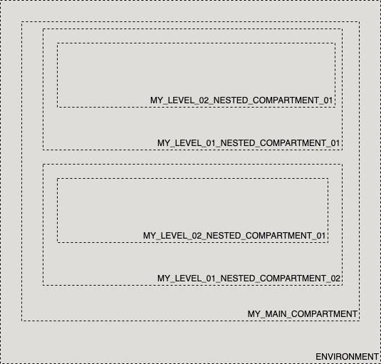

# OCI Cloud Bricks: Compartment

[](https://img.shields.io/badge/license-UPL-green) [](https://sonarcloud.io/dashboard?id=oracle-devrel_terraform-oci-cloudbricks-compartment)

## Introduction
The following cloud brick enables you to create compartments inside a tenancy. You can hook a compartment right from parent/root or you can nest them accoringly to your needs

## Reference Architecture
The folllowing is the reference architecture associated to this brick



### Prerequisites
- OCID of Root Compartment

---
## Sample tfvar file

If the compartment is child of root:

```shell
########## ROOT PARENT ##########
########## SAMPLE TFVAR FILE ##########
########## PROVIDER SPECIFIC VARIABLES ##########
region           = "foo-region-1"
tenancy_ocid     = "ocid1.tenancy.oc1..abcdefg"
user_ocid        = "ocid1.user.oc1..aaaaaaabcdefg"
fingerprint      = "fo:oo:ba:ar:ba:ar"
private_key_path = "/absolute/path/to/api/key/your_api_key.pem"
########## PROVIDER SPECIFIC VARIABLES ##########

########## ARTIFACT SPECIFIC VARIABLES ##########
is_root_child           = true
compartment_name        = "COMPARTMENT_NAME"
compartment_description = "COMPARTMENT_DESCRIPTION"
enable_delete           = true
sleep_timer  = 60
########## ARTIFACT SPECIFIC VARIABLES ##########
########## SAMPLE TFVAR FILE ##########
########## ROOT PARENT ##########
```

If the compartment is not child of root

```shell
########## NOT ROOT PARENT ##########
########## SAMPLE TFVAR FILE ##########
########## PROVIDER SPECIFIC VARIABLES ##########
region           = "foo-region-1"
tenancy_ocid     = "ocid1.tenancy.oc1..abcdefg"
user_ocid        = "ocid1.user.oc1..aaaaaaabcdefg"
fingerprint      = "fo:oo:ba:ar:ba:ar"
private_key_path = "/absolute/path/to/api/key/your_api_key.pem"
########## PROVIDER SPECIFIC VARIABLES ##########

########## ARTIFACT SPECIFIC VARIABLES ##########
parent_compartment_name = "DISPLAY_NAME_OF_PARENT_COMPARTMENT"
compartment_name = "COMPARTMENT_NAME"
compartment_description = "COMPARTMENT_DESCRIPTION"
enable_delete = true
sleep_timer  = 60
########## ARTIFACT SPECIFIC VARIABLES ##########
########## SAMPLE TFVAR FILE ##########
########## NOT ROOT PARENT ##########
```

### Variable specific considerations
- When creating a top level compartment nested under on root, is mandatory that variable `is_root_child` is set to true.
- In both cases, the variable `enable_delete` should be set to `true` if eventually compartments are required to be deleted programatically using terraform. This variable by default is `false`
- You can nest up to six level of depness in compartments. Avoid using deeper nesting as IAM policies will fail to work
- You can create as many compartments as needed, always respecting the nesting limitations
- Always create compartments with unique names. This is mandatory for bricks framework to work properly
- Variable `sleep_timer` provides a mean to delay the dependant creation of further child compartments giving time for full creation. By default this value is set to 60 seconds. It can be increased depending on needs. 

---

## Sample provider
The following is the base provider definition to be used with this module

```shell
terraform {
  required_version = ">= 1.0.0"
}

provider "oci" {
  region       = var.region
  tenancy_ocid = var.tenancy_ocid
  user_ocid        = var.user_ocid
  fingerprint      = var.fingerprint
  private_key_path = var.private_key_path
  disable_auto_retries = "true"
}

provider "oci" {
  alias        = "home"
  region       = data.oci_identity_region_subscriptions.home_region_subscriptions.region_subscriptions[0].region_name
  tenancy_ocid = var.tenancy_ocid  
  user_ocid        = var.user_ocid
  fingerprint      = var.fingerprint
  private_key_path = var.private_key_path
  disable_auto_retries = "true"
}
```
---

## Variable documentation
## Requirements

| Name | Version |
|------|---------|
| <a name="requirement_terraform"></a> [terraform](#requirement\_terraform) | >= 1.0.0 |
| <a name="requirement_oci"></a> [oci](#requirement\_oci) | >= 4.36.0 |

## Providers

| Name | Version |
|------|---------|
| <a name="provider_null"></a> [null](#provider\_null) | 3.1.0 |
| <a name="provider_oci"></a> [oci](#provider\_oci) | 4.55.0 |
| <a name="provider_oci.home"></a> [oci.home](#provider\_oci.home) | 4.55.0 |

## Modules

No modules.

## Resources

| Name | Type |
|------|------|
| [null_resource.timer](https://registry.terraform.io/providers/hashicorp/null/latest/docs/resources/resource) | resource |
| [oci_identity_compartment.Compartment](https://registry.terraform.io/providers/hashicorp/oci/latest/docs/resources/identity_compartment) | resource |
| [oci_identity_compartments.PARENTCOMPARTMENT](https://registry.terraform.io/providers/hashicorp/oci/latest/docs/data-sources/identity_compartments) | data source |
| [oci_identity_region_subscriptions.home_region_subscriptions](https://registry.terraform.io/providers/hashicorp/oci/latest/docs/data-sources/identity_region_subscriptions) | data source |

## Inputs

| Name | Description | Type | Default | Required |
|------|-------------|------|---------|:--------:|
| <a name="input_compartment_description"></a> [compartment\_description](#input\_compartment\_description) | Compartment Description | `any` | n/a | yes |
| <a name="input_compartment_name"></a> [compartment\_name](#input\_compartment\_name) | Compartment Display Name | `any` | n/a | yes |
| <a name="input_enable_delete"></a> [enable\_delete](#input\_enable\_delete) | Enables if Terraform is allowed to programatically delete this compartment upon invoking destroy command | `bool` | `false` | no |
| <a name="input_fingerprint"></a> [fingerprint](#input\_fingerprint) | API Key Fingerprint for user\_ocid derived from public API Key imported in OCI User config | `any` | n/a | yes |
| <a name="input_is_root_child"></a> [is\_root\_child](#input\_is\_root\_child) | Boolean that describes if the compartment is a child of root | `bool` | `false` | no |
| <a name="input_parent_compartment_name"></a> [parent\_compartment\_name](#input\_parent\_compartment\_name) | Display name of Parent Compartment | `string` | `""` | no |
| <a name="input_private_key_path"></a> [private\_key\_path](#input\_private\_key\_path) | Private Key Absolute path location where terraform is executed | `any` | n/a | yes |
| <a name="input_region"></a> [region](#input\_region) | Target region where artifacts are going to be created | `any` | n/a | yes |
| <a name="input_sleep_timer"></a> [sleep\_timer](#input\_sleep\_timer) | Sleep timer in seconds to wait for compartment to be created | `number` | `60` | no |
| <a name="input_tenancy_ocid"></a> [tenancy\_ocid](#input\_tenancy\_ocid) | OCID of tenancy | `any` | n/a | yes |
| <a name="input_user_ocid"></a> [user\_ocid](#input\_user\_ocid) | User OCID in tenancy. | `any` | n/a | yes |

## Outputs

| Name | Description |
|------|-------------|
| <a name="output_compartment"></a> [compartment](#output\_compartment) | Compartment Object |

## Contributing
This project is open source.  Please submit your contributions by forking this repository and submitting a pull request!  Oracle appreciates any contributions that are made by the open source community.

## License
Copyright (c) 2021 Oracle and/or its affiliates.

Licensed under the Universal Permissive License (UPL), Version 1.0.

See [LICENSE](LICENSE) for more details.
